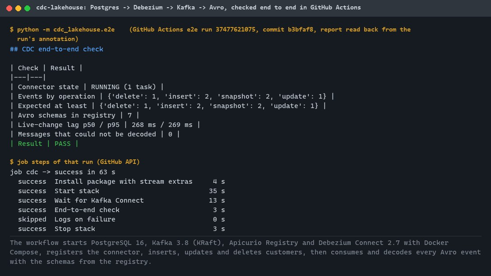
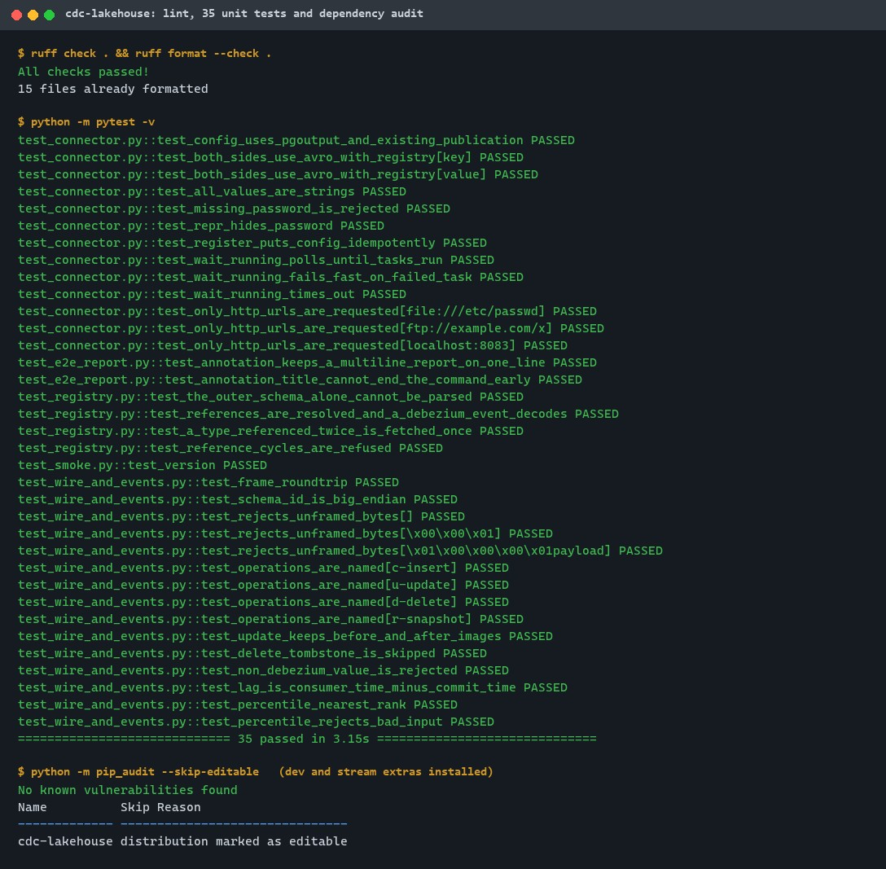
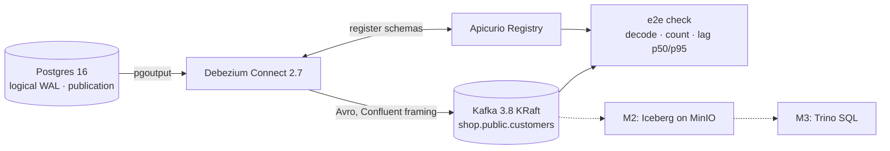
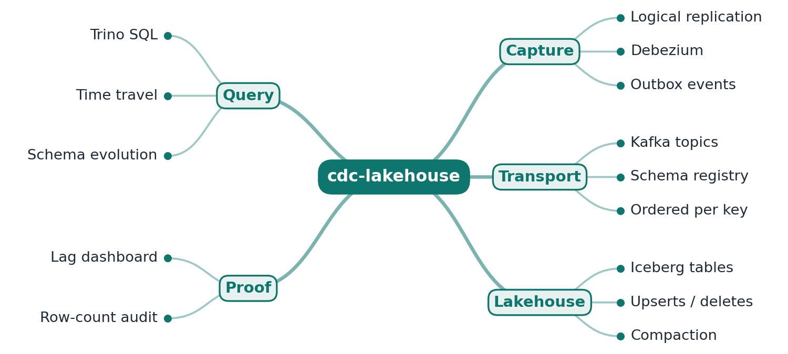
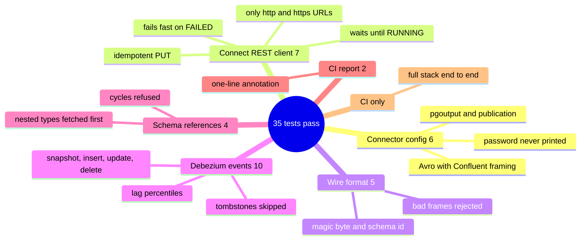

# cdc-lakehouse

[](https://github.com/EquinoxWN/cdc-lakehouse/actions/workflows/ci.yml)
[](https://github.com/EquinoxWN/cdc-lakehouse/actions/workflows/e2e.yml)


> Fresh analytics without hammering the production database, step one: Debezium streams every Postgres insert, update and delete into Kafka as Avro events, checked end to end in CI with about 270 ms lag.

Part of my **Data Engineering** list · Python · SQL · core project

## Proof it works

GitHub Actions starts PostgreSQL, Kafka, the schema registry and Debezium, then the end-to-end check changes rows and decodes every resulting Avro event from Kafka: all 6 expected events arrive, none fail to decode, and a change reaches the consumer in about 270 ms. The report below is the one the run published:



Locally, lint is clean, 35 unit tests pass, and pip-audit finds no known vulnerabilities in the dependencies, including the streaming extras:



## Architecture

**What M1 runs today:**



**Full roadmap (M1 to M3):**



## How it works

_Steps 1 and 2 are built and tested (M1); the rest is on the [roadmap](#roadmap)._

1. Debezium reads Postgres's write-ahead log through logical replication and emits one event per insert, update or delete, with no change to the application.
2. Events land in Kafka with Avro schemas in a schema registry, so consumers know the exact shape of every version.
3. The Iceberg sink connector writes the changes into Iceberg tables on S3-compatible storage, applying upserts and deletes by primary key.
4. Scheduled maintenance compacts small files and expires old snapshots, keeping queries fast and storage bounded.
5. Trino queries the tables with plain SQL, including time travel (`FOR TIMESTAMP AS OF`) to see yesterday's data.
6. A new Postgres column flows through end to end, and a reconciliation job compares row counts and checksums between source and lake.

## Tech stack

| Area | In M1 | Planned |
|---|---|---|
| Capture | PostgreSQL 16 logical replication, Debezium 2.7 on Kafka Connect | - |
| Transport | Kafka 3.8 (KRaft), Avro with Apicurio Registry | Kafka Connect Iceberg sink |
| Lake / query | - | Apache Iceberg on MinIO (S3 API), Iceberg REST catalog, Trino |
| Run / test | Docker Compose, Python check (psycopg, confluent-kafka, fastavro), GitHub Actions e2e | Terraform for an AWS variant |

Language: **Python · SQL**, with Docker Compose for the stack.

| Path | What it is |
|---|---|
| `docker-compose.yml` | Postgres 16 (logical WAL), Kafka 3.8 (KRaft), Apicurio Registry, Debezium Connect 2.7 |
| `sql/init.sql`, `sql/init.sh` | Source tables, least-privilege `debezium` replication role, publication, seed rows |
| `src/cdc_lakehouse/connector.py` | Debezium connector config and Kafka Connect REST client (register, wait until RUNNING) |
| `src/cdc_lakehouse/wire.py` | Confluent Avro wire format (magic byte + schema id) |
| `src/cdc_lakehouse/events.py` | Debezium envelope to `ChangeEvent`, lag and percentiles |
| `src/cdc_lakehouse/e2e.py` | End-to-end check: change rows, consume and decode events, report |
| `.github/workflows/e2e.yml` | Runs the whole stack and the end-to-end check on every push |

## Run it

Needs Python 3.11 or newer; Docker only for the stack.

```bash
make setup   # install the package and dev tools
make test    # unit tests (no Docker needed)
make up      # start Postgres, Kafka, the registry and Debezium Connect
make e2e     # register the connector, change rows, consume and verify Avro events
make down    # stop everything and delete the volumes
```

Passwords for the local stack come from `POSTGRES_PASSWORD` and `DEBEZIUM_PASSWORD` (defaults are for local use only). Once the stack is up, events for `public.customers` land on the Kafka topic `shop.public.customers`.

## Tests and results

Latest local run (full detail in [docs/results/m1.md](docs/results/m1.md)):

| Check | Result |
|---|---|
| Unit tests (config, Connect REST, wire format, envelopes, schema references) | 35 passed, 0 failed |
| `pip-audit` (dev and stream extras) | no known vulnerabilities |
| `ruff` | clean |
| `actionlint` on both workflows | no errors |
| Compose file and image tags | valid; all 4 images exist |

The end-to-end check runs in the `e2e` GitHub Actions workflow on every push. Latest result ([run 37477621075](https://github.com/EquinoxWN/cdc-lakehouse/actions/runs/37477621075)): 2 snapshot, 2 insert, 1 update and 1 delete events decoded from Avro, 0 undecodable messages, commit-to-consumer lag p50 268 ms and p95 269 ms. The report is published as a run annotation, readable without signing in.

### Test map



## Roadmap

**M1** (≈15 h)
- [x] Write `docs/rfc/0001-design.md`: problem, goals, non-goals, chosen design
- [x] Debezium reads Postgres's write-ahead log through logical replication and emits one event per insert, update or delete, with no change to the application.
- [x] Events land in Kafka with Avro schemas in a schema registry, so consumers know the exact shape of every version.

**M2** (≈20 h)
- [ ] The Iceberg sink connector writes the changes into Iceberg tables on S3-compatible storage, applying upserts and deletes by primary key.
- [ ] Scheduled maintenance compacts small files and expires old snapshots, keeping queries fast and storage bounded.

**M3** (≈25 h)
- [ ] Trino queries the tables with plain SQL, including time travel (`FOR TIMESTAMP AS OF`) to see yesterday's data.
- [ ] A new Postgres column flows through end to end, and a reconciliation job compares row counts and checksums between source and lake.
- [ ] Publish the proof below with real numbers

## Proof

What this repo must show before it counts as done:

- End-to-end lag p95 chart, a schema-evolution demo, and a reconciliation report showing zero drift.

| Result | Value |
|---|---|
| M3 proof above | Not measured yet (M3). Current M1 numbers: see [Tests and results](#tests-and-results). |

## Why it matters

- **Interview angle:** 'Sync an OLTP database to analytics in near real time'.
- **Upstream I'd like to contribute to:** Debezium, Apache Iceberg or Apache Paimon (Alibaba origin).

## Design docs

- [RFC 0001: design](docs/rfc/0001-design.md)
- [ADR 0001: record architecture decisions](docs/adr/0001-record-architecture-decisions.md)
- [ADR 0002: Apicurio schema registry, Confluent wire format](docs/adr/0002-apicurio-registry-confluent-wire-format.md)

## Scope

This is a learning and portfolio system, not a hosted production service. Everything runs locally.

## Security and contributing

- Every GitHub Action is pinned to a commit SHA; workflows run read-only, without persisted credentials.
- Dependabot proposes dependency and action updates weekly.
- `ruff` with security (bandit) rules and `ruff format --check` on every push; `pip-audit` (`make audit`) in CI.
- Report vulnerabilities privately: see [SECURITY.md](SECURITY.md). To contribute, see [CONTRIBUTING.md](CONTRIBUTING.md).

## License

MIT, see [LICENSE](LICENSE).
